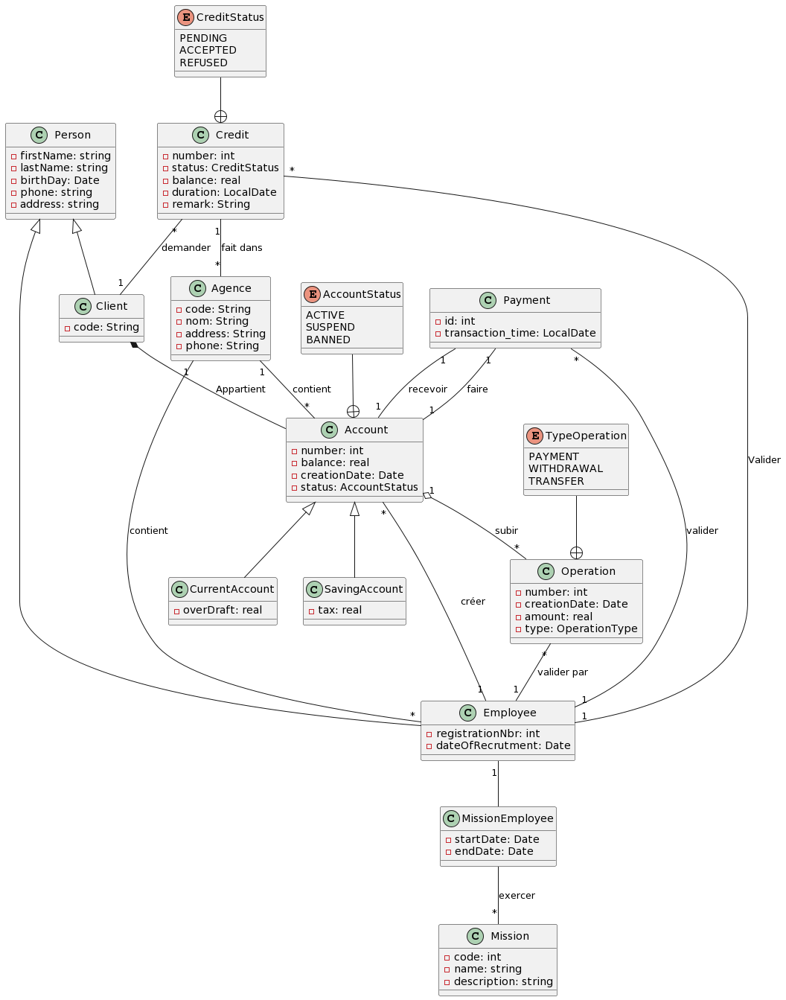

# Banking Managment App
## 1- class Diagram
***the following picture is the representation of the class digram of this project***

## 2- Projct structure
 ***The project is devidedinto serviral packages:***
 - **Connection**: contain the singleton class responsable about `PG` connection
 - **DAO**: contain all the DAO interfaces and implementation for the project entities
 - **Entity**: the defintion for each class in the digram
 - **Enum**: contain all the enumuration used in the project
 - **Exception**: defining some Excpetions that must be used in the controlling specific errors
 - **Service**: contain Business logic for entities
 - **Vue**: contain the interaction(I/O) with the end user.
## 3- project workflow and architecture
## 4- Testing
for testing we can go to `/src/test/java` and you will find a Testing class for each (entity/dao) of the project.
in this project i'm using `JUnit` as testing tool.